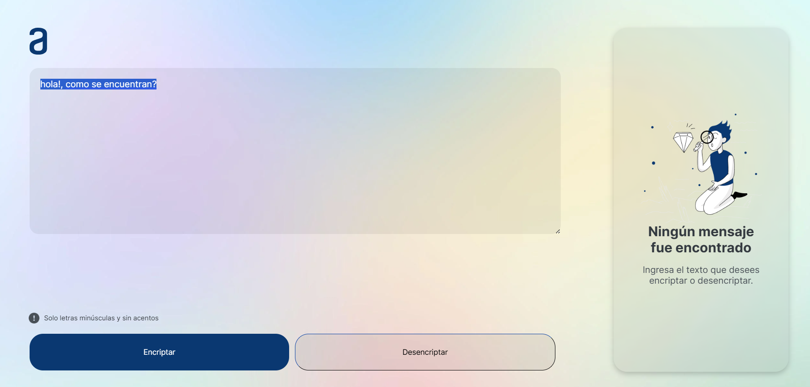
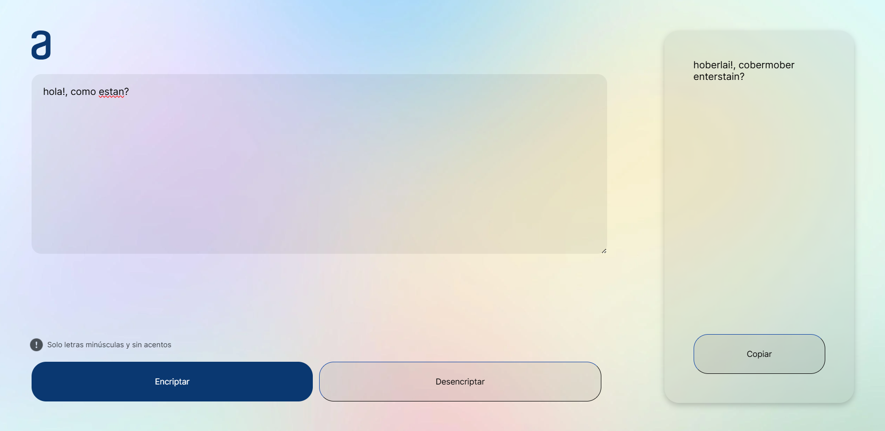
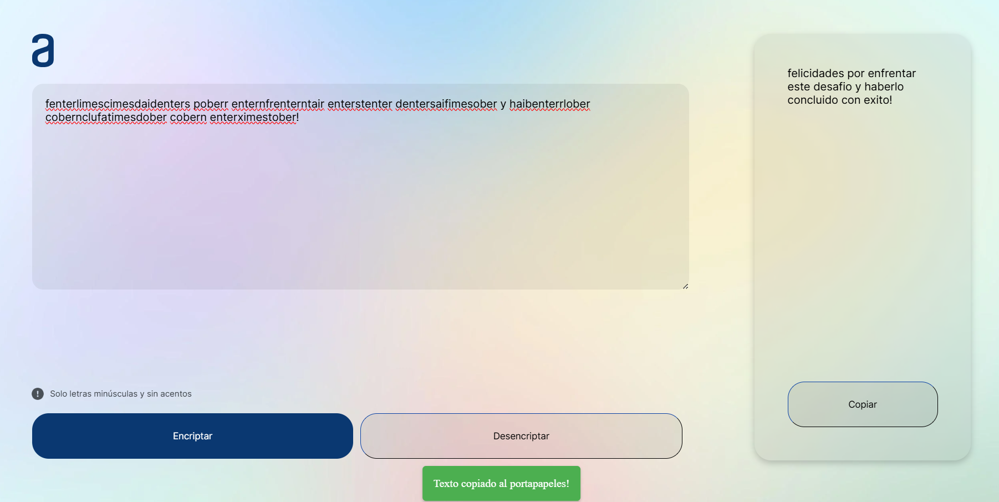

<!-- Improved compatibility of volver al inicio link: See: https://github.com/othneildrew/Best-README-Template/pull/73 -->
<a id="readme-top"></a>
<!--
*** Thanks for checking out the Best-README-Template. If you have a suggestion
*** that would make this better, please fork the repo and create a pull request
*** or simply open an issue with the tag "enhancement".
*** Don't forget to give the project a star!
*** Thanks again! Now go create something AMAZING! :D
-->

<!-- PROJECT SHIELDS -->
<!--
*** I'm using markdown "reference style" links for readability.
*** Reference links are enclosed in brackets [ ] instead of parentheses ( ).
*** See the bottom of this document for the declaration of the reference variables
*** for contributors-url, forks-url, etc. This is an optional, concise syntax you may use.
*** https://www.markdownguide.org/basic-syntax/#reference-style-links
-->

<!-- PROJECT LOGO -->
<br />
<div align="center">
  <a href="https://github.com/WiscasHubble/ChallengeAluraEncriptador">
    
  </a>

<h3 align="center">ChallengeAluraEncriptador</h3>

  <p align="center">
    Encriptador de texto desarrollado con JS
  </p>
</div>

<!-- TABLE OF CONTENTS -->
<details>
  <summary>Tabla de contenidos</summary>
  <ol>
    <li>
      <a href="#acerca-del-proyecto-">Acerca del proyecto 🐱📢</a>
      <ul>
        <li><a href="#características-principales">Características principales</a></li>
        <li><a href="#construido-con">Construido con 🛠️</a></li>
      </ul>
    </li>
    <li>
      <a href="#cómo-empezar-">¿Cómo empezar? 🐣</a>
    </li>
    <li><a href="#uso-">Uso ⌨️🖱️</a></li>
    <li><a href="#contacto-">Contacto 👤</a></li>
  </ol>
</details>

<!-- ABOUT THE PROJECT -->
## Acerca del proyecto 🐱📢

[![Product Name Screen Shot][product-screenshot]]

Bienvenido al encriptador de texto, una herramienta sencilla pero efectiva desarrollada con JavaScript. Este proyecto tiene como objetivo proporcionar una forma rápida y segura de encriptar y desencriptar mensajes utilizando un conjunto específico de reglas de sustitución de caracteres. Ideal para aquellos que buscan una capa adicional de privacidad en sus comunicaciones cotidianas.

### Características principales

- **Encriptación personalizada**: Transforma las vocales en tu texto mediante sustituciones únicas para mayor seguridad.
  - La letra "e" se convierte en "enter".
  - La letra "i" se convierte en "imes".
  - La letra "a" se convierte en "ai".
  - La letra "o" se convierte en "ober".
  - La letra "u" se convierte en "ufat".
- **Desencriptación fácil**: Revertir el texto encriptado a su forma original es tan sencillo como un clic.
- **Validación de entrada**: Asegura que el texto ingresado esté en minúsculas y sin acentos o caracteres especiales.
- **Interfaz amigable**: Una interfaz web intuitiva y fácil de usar que permite a los usuarios encriptar y desencriptar texto de manera eficiente.

<p align="right">(<a href="#readme-top">volver al inicio</a>)</p>

### Construido con

* [![HTML5][HTML5]][HTML5-url]
* [![CSS3][CSS3]][CSS3-url]
* [![JavaScript][JavaScript]][JavaScript-url]

<p align="right">(<a href="#readme-top">volver al inicio</a>)</p>

<!-- GETTING STARTED -->
## ¿Cómo empezar? 🐣

Para comenzar con este proyecto, sigue estos pasos:

1. Clona el repositorio: 
    ```sh
    git clone https://github.com/WiscasHubble/ChallengeAluraEncriptador.git
    ```
2. Abre el archivo `index.html` en tu navegador web.

<p align="right">(<a href="#readme-top">volver al inicio</a>)</p>

<!-- USAGE EXAMPLES -->
## Uso ⌨️🖱️

1. Ingresa el texto que deseas encriptar en el textarea (asegúrate de que no sea un texto con mayúsculas, acentos o caracteres especiales).
   
   

2. Haz clic en el botón "Encriptar".
   
   

3. Copia el texto encriptado o desencripta un mensaje ingresando el texto encriptado y haciendo clic en "Desencriptar".
   
   

<p align="right">(<a href="#readme-top">volver al inicio</a>)</p>

<!-- CONTACT -->
## Contacto 👤

Link del proyecto: [https://github.com/WiscasHubble/ChallengeAluraEncriptador](https://github.com/WiscasHubble/ChallengeAluraEncriptador)

LinkedIn: [www.linkedin.com/in/luis-acevedo-sl](https://www.linkedin.com/in/luis-acevedo-sl)

<p align="right">(<a href="#readme-top">volver al inicio</a>)</p>

<!-- MARKDOWN LINKS & IMAGES -->
<!-- https://www.markdownguide.org/basic-syntax/#reference-style-links -->
[product-screenshot]: Assets/Img/Screenshot.png
[HTML5]: https://img.shields.io/badge/HTML5-E34F26?style=for-the-badge&logo=html5&logoColor=white
[HTML5-url]: https://developer.mozilla.org/en-US/docs/Web/HTML
[CSS3]: https://img.shields.io/badge/CSS3-1572B6?style=for-the-badge&logo=css3&logoColor=white
[CSS3-url]: https://developer.mozilla.org/en-US/docs/Web/CSS
[JavaScript]: https://img.shields.io/badge/JavaScript-F7DF1E?style=for-the-badge&logo=javascript&logoColor=black
[JavaScript-url]: https://developer.mozilla.org/en-US/docs/Web/JavaScript
